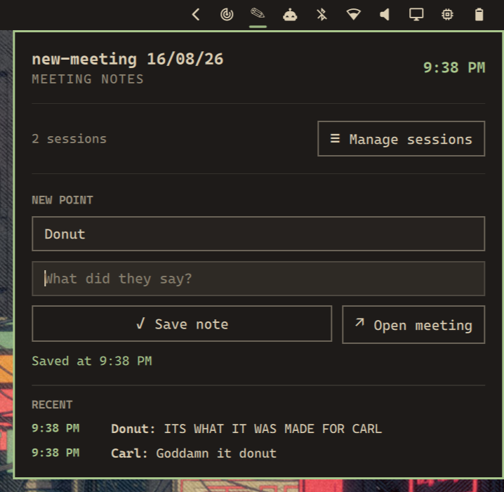

# Meeting Notes for Omarchy

A compact Omarchy bar widget for capturing notes across named meeting sessions. Each meeting gets its own Markdown file, stored in a directory you control.



## Features

- Capture notes from the keyboard alone: bind a key, then <kbd>Tab</kbd> and <kbd>Enter</kbd> through the panel
- Create, rename, switch, and recoverably delete meeting sessions
- Keep each meeting in a separate Markdown file
- Choose a custom notes directory outside the plugin
- Capture timestamped notes with an author name
- Focus the author field whenever the panel opens
- Open the active Markdown file in Omawrite, with the default Omarchy editor as fallback
- Confirm deletion with a second press; archive deleted session data locally

## Requirements

- Omarchy with the Quickshell plugin system
- Python 3
- Omawrite is optional; when unavailable, the widget uses `omarchy-launch-editor`

The plugin does not require root access, a network service, or third-party Python packages.

## Install

```bash
omarchy plugin add https://github.com/Aayushstha03/omarchy-meeting-notes.git --enable --yes
```

Omarchy clones the plugin into `~/.config/omarchy/plugins/`, then adds the widget to the right side of your bar. Move it with `omarchy bar move`.

To install a local checkout while developing:

```bash
omarchy plugin add /path/to/omarchy-meeting-notes --enable --yes
```

## Use

Click the Meeting Notes widget in the bar, or bind a key and keep both hands on the keyboard. The author field receives keyboard focus when the panel opens.

### Keyboard flow

The panel captures notes without the mouse. Bind the shortcut below, then work through the fields with <kbd>Tab</kbd> and <kbd>Enter</kbd>.

| Key | Action |
|-----|--------|
| <kbd>Tab</kbd> | Move forward: author → note → **Save note** |
| <kbd>Shift</kbd>+<kbd>Tab</kbd> | Move backward through the same three stops |
| <kbd>Enter</kbd> in the author field | Move to the note field |
| <kbd>Enter</kbd> in the note field | Save the note |
| <kbd>Enter</kbd> or <kbd>Space</kbd> on **Save note** | Save the note |
| <kbd>Esc</kbd> | Close the panel |

A full capture is five steps: press the shortcut, type the speaker, press <kbd>Enter</kbd>, type the point, press <kbd>Enter</kbd>.

The panel returns focus to the note field after each save. The author field keeps its value, so a run of notes from the same speaker needs only the note text. The widget also remembers the last author and restores it the next time the panel opens.

Bind the panel to <kbd>Super</kbd>+<kbd>Ctrl</kbd>+<kbd>M</kbd> with:

```lua
local o = require("omarchy")
o.bind("SUPER + CTRL + M", "Meeting notes", "omarchy-shell io.github.aayushstha03.meeting-notes toggle")
```

Add it to your existing Omarchy Lua keybinding configuration.

### Sessions

Open **Manage sessions** to create, rename, switch, or delete meetings. A new meeting defaults to `new-meeting DD/MM/YY` and starts with an empty author field. Deletion requires pressing its trash icon twice within five seconds.

Right-click the bar widget to open the active meeting file in your editor.

## Storage and configuration

The plugin keeps its settings separate from its installation:

- Configuration: `~/.config/omarchy/meeting-notes.json`
- Internal session data: `~/.local/share/omarchy-meeting-notes/`
- Default Markdown directory: `~/Documents/Meeting Notes/`
- Recoverable deletions: `~/.local/share/omarchy-meeting-notes/deleted/`

Change the Markdown directory from the panel, or edit the configuration file:

```json
{
  "notesDirectory": "~/Documents/Meeting Notes"
}
```

Existing Markdown files are not removed when the directory changes.

## Remove

```bash
omarchy plugin remove io.github.aayushstha03.meeting-notes
```

Removing the plugin does not delete your Markdown files, configuration, or internal session data.

## Development

Validate the manifest and entry point with:

```bash
omarchy plugin validate .
qmllint --silent Panel.qml
python3 -m py_compile meeting-notes
```

## License

[MIT](LICENSE)
